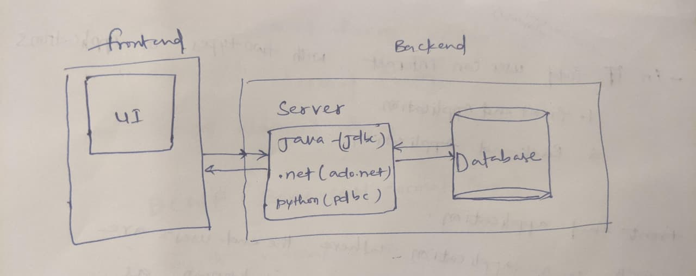
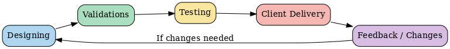

# Orcale-Notes

## CONTENTS:

## 1. DBMS

## 2. ORACLE

## 3. SQL

- Intro to SQL
- sub languages of SQL
- data types in oracle sql
- operators in oracle sql
- functions in oracle sql
- clauses in oracle sql
- joins
- constraints
- sub queries
- sequences
- indexes

## 4. Normalization

- what is normalization
- where we want to use normalization
- why we need normalization
- types of normalization
- first normal form
- second normal form
- third normal form
- BCNF (boyce-codd normal form)
- fourth normal form
- fifth normal form

## 5. PL/SQL

- introduction to pl/sql
- diffrence between sql and pl/sql
- conditionals and looping statements
- cursors
- exception handling
- stored procedures
- triggeres

---

in IT(information technology ) field user can interact with two type of applications

1.front-end application

2.back-end application

## 1.front-end application

- FEA is a application where the end users are interacting with a page directly is known as front-end -applications

ex: home page ,register form ,login view ,form …

### design & develop:

ui-technologies (html,css,javascript ,angular , jquery)

## 2.back-end application

-BEA is a application where we can store the end-users data/information

ex: database applications

### design&develop:

-DB technologies (oracle,mysql,sqlserver,postgresql…)

### serverside technologies:

-server side technologies are used to established

ex:java,.net,python..

## 1.DBMS

### what is data?

-it is raw fact (i.e charecters, numbers,special char and symbols)

-data will never give meaning ful statements.

ex : 1001 is data smith is data

1002 is data alien is data

1003 is data muller is data

01-jan-2025

10-march-2025

-we/user cannot predit what is it → it is called as data

-data is nothing but unclassified raw facts or unmeaningful

### what is information?

-processed data is called information.

-information is always provide meaningful statements

ex:

| emp_id | emp_name | emp_hiredate |
| ------ | -------- | ------------ |
| 1001   | smith    | 01-jan-2025  |
| 1002   | allen    | 15-mar-2025  |
| 1003   | miller   | 23-sep-2024  |

we can easily classified as employed related data so that is called information

### what is database?

-database is a location/memory where we can store data

-it is a memory which is used to store the collection of interrelated /information of an organization

ex:bank_database,university_database…

### Bank \_database:

-SBI_DATABASE:

-TBL_BRANCH

-BCODE,BANKNAME,BLOC

-TBL_DEPT

-DEPTID,DEPTNAME,LOC

-TBL-EMP

-EMPID,ENAME,DESIGNATION,HIREDATE

-TBL_CUSTUMER

-A/C_NAME,C_NAME,MB_NO

Project Development Lifecycle (basic) :

DESIGNING → VALIDATIONS → TESTING →CLIENT DELIVERY (if client needs any changes ) →DESIGNING

### TYPES OF DATABASES:

- Databases are broadly classified into **two types**: - OLTP(online transaction processing) - OLAP(online analytical processing)

  1.OLTP:

-to store ‘day to day’ transactional information.

-ex: oracle , my sql,postgresql,sybase etc..

2.OLAP:

-to store historical data , to describe data to analysis data and to genarate reporting on data.

-ex: data_warehouse,Business intellgense tools(POWERBI,MSBI..etc)

### what is DBMS?

-it is a software which is used to manage and maintain data/information with in the dabase

-by using dbms software we will perform the followinfg operations are:

1. CREATING DATABASES
2. CREATING TABLES
3. INSERTING DATA
4. UPDATING THE DATA
5. READING DATA
6. DELETING DATA

   -DBMS will act as an interface betwwen user and databases

   user ↔ DBMS (software) ↔ database

### MODELS OF DBMS:

-theres are 3 types of dbms models

1. HDBMS(hirarchial database management system)
   1. S/W: IMS
2. NDBMS(network database management system)
   1. s/w: IDBMS

NOTE:HDBMS,NDBMS models are outdated in real time.

-IMS is first DB software

1. RDBMS(realtional database management system)

   -it again classified into two sub models , those are:

   1. ORDBMS(object relational DMBS)
   2. OODBMS(object oriented DBMS)

   1.ORDBMS:

   -these databases are used for storing / organizing data in tabular format

   Tables = collection of rows & columns

   Row = group of column

   database = group of tables

   -row can be called as ‘records/tuples’

   -column can be called as ‘attribute / fields’

   -these databases are adepending on ‘sql’ so that these databases are called ‘sql databases’ in real world.

   ex: oracle,mysql,informx,ingres,sql server,dbz,sybase,postgresql

   2.OODBMS:

   -these database are organised data in the form of ‘OBJECTS’

   -these are depends on ‘OOPS’ conceps but not depend on ‘sql’ language so that these databases are called as ‘No Sql Databases ‘ in real world .

   ex: mongoDb,Cassandra,redis..etc
